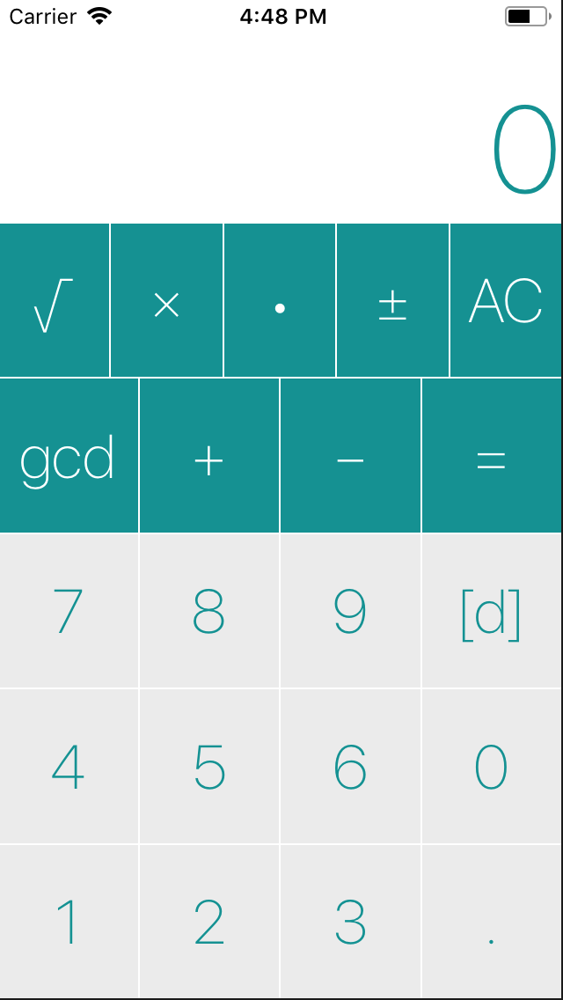

# Veculator
A vector(R2) calculator programmed in swift. Individual Project.
 A "vectorized" verson of Calculator in Stanford CS193P 
 Aims for **self-learning** purposes
- Development Period(including learning swift) - 2 weeks

## Tool Used
- Xcode, swift 3.0
- Implemented in MVC framework

## Notes
- Directory **_Vec_** contains source code and can be opened using Xcode directly.
- File **VeculatorBrain.swift** is the Model component.
- File **ViewController.swift** is the Controller component.
- File **Base.Iproj/Main.storyboard** is a single page View component. 

## Future Development
This app will probably not be on app store. A negative button needs to be added. What I have now is only a direction switching button. When I want it to be on the app store, many adjustments are needed.

### Picture
The GCD button is only added for 1st-year university courses, it will be removed later. 

